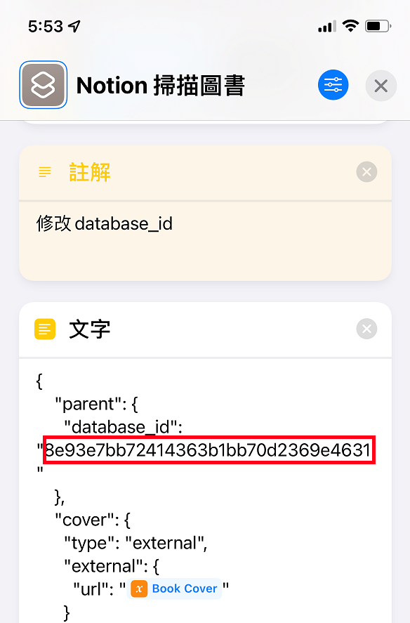

# Notion 圖書掃描登入

利用 iPhone 掃描條碼，透過 Google Book APIs 取得書籍資訊後，寫入 Notion

- IOS 捷徑連結：[捷徑](https://www.icloud.com/shortcuts/8a20b5e3c0734e1d8d14af7c06622da8)
- Notion 模板連結：[模板](https://lily-tilapia-0a6.notion.site/8e93e7bb72414363b1bb70d2369e4631?v=b3a9ab68b941496cbdaa9768417d6fd4)

---

## API 說明

我是利用 Google Book APIs，不過台灣有些書本的資訊會不齊。

下面範例為：王爾德短篇小說集 [(博客來連結)](https://www.books.com.tw/products/0010568845)

### 取得書本資訊

透過 isbn 碼我們可以送出請求，書本資訊都是放在 volumeInfo 這層中，我只擷取書名、作者、出版社、出版日期、描述以及頁數。

請求 URL 如下：

```text
https://www.googleapis.com/books/v1/volumes?q=isbn:9789861782584&fields=items/volumeInfo(title,authors,publisher,publishedDate,description,pageCount)
```

結果

```json
{
    "items": [
        {
            "volumeInfo": {
                "title": "王爾德短篇小說集（中英雙語版）",
                "authors": [
                    "王爾德"
                ],
                "publisher": "How-Do Publishing Co., Ltd. (好讀出版有限公司)",
                "publishedDate": "2012-12-15",
                "description": "人世間的愛與智慧，都在王爾德諷諭的筆下！ 愛爾蘭文學的代表•唯美浪漫主義的奉行者 十九世紀英國文化偶像王爾德 為藝術而藝術，眼眸望向弱勢──創作橫跨小說、戲劇、散文、詩曲 本書獻上王爾德最知名的九則短篇故事，並以中英對照方式呈現， 讓讀者讀好看故事的同時，還可增進自我英文閱讀能力── 1〈快樂王子〉：熟知城中人們貧苦的快樂王子一點也不快樂，直到在小燕子的協助下，他們貢獻出了所有…… 2〈夜鶯與玫瑰〉：為了成全年輕人高貴的愛情，夜鶯以自己的鮮血染紅了玫瑰…… 3〈自私的巨人〉：巨人封閉了庭院，嚴禁孩童們來此玩耍、分享庭院的美好。但是，春天也自此不再報到…… 4〈一個忠實的朋友〉：要如何做才能當一個忠實的朋友呢？讓大個兒休伊告訴您！ 5〈驕傲的爆竹〉：「我相信我來自最優秀的家庭、我是最好的、我為此而感動！」驕傲的爆竹留下了淚水，為自己的表演帶來了變數…… 6〈年輕的國王〉：即將登基的年輕國王擁有世界上最珍貴的珠寶服飾，卻在一夜之間選擇了以乞丐般的裝扮參加加冕禮！ 7〈公主的生日〉：醜陋的小矮人在公主的生日宴會上深受歡迎，甚至收到了公主親手丟下的玫瑰，一切是如此美好，原來…… 8〈星星男孩〉：恃寵而驕的星星男孩深信自己來自上天，是獨一無二的，直到一個女乞丐說出他是自己的孩子…… 9〈漁夫和他的靈魂〉：漁夫愛上了美人魚，可是在一起的條件卻是必須割捨掉自己的靈魂…… 世界級讚譽 ※美國媒體女強人歐普拉「經典文學讀書俱樂部」，盛譽其為「史上最重要的10位愛爾蘭作家」之一 （與作家喬伊斯、格列佛，詩人葉慈，劇作家貝克特齊名） ※十九世紀末英國唯美派代表作家，集詩人、小說家、劇作家、說故事高手、美學主義者於一身",
                "pageCount": 328
            }
        }
    ]
}
```

### 取得書本封面

先取得書本 id 後，再從另一個網址取得畫質較高的封面。

取得 id URL

```text
https://www.googleapis.com/books/v1/volumes?q=isbn:9789861782584&fields=items/id

```

取得 id 結果

```json
{
    "items": [
        {
            "id": "1ZMIEAAAQBAJ"
        }
    ]
}
```

取得封面

```text
https://books.google.com/books/publisher/content?id=1ZMIEAAAQBAJ&printsec=frontcover&img=1&zoom=6
```

---

### Notion 設定

複製Notion 模板 [(連結)](https://lily-tilapia-0a6.notion.site/8e93e7bb72414363b1bb70d2369e4631?v=b3a9ab68b941496cbdaa9768417d6fd4)

前往 <https://www.notion.so/my-integrations>，點擊(New> integration)創建一個機器人，輸入名字、Logo，需要用到的空間、全選上支持的能力（讀取、更新、寫入內容）、基本上調整前面三個，後面默認就好。


之後前往創建好的數據庫邀請機器人。


---

## 捷徑說明

複製捷徑連結：[捷徑](https://www.icloud.com/shortcuts/8a20b5e3c0734e1d8d14af7c06622da8)

### 調整捷徑內容

修改 Notion Database Id

打開複製好的 Notion 頁面後按上方的 Share，點開選最下面的Copy Link
你就會取得這樣的連結

```text
https://www.notion.so/8e93e7bb72414363b1bb70d2369e4631?v=b3a9ab68b941496cbdaa9768417d6fd4
```

**8e93e7bb72414363b1bb70d2369e4631** 就是你的 database_id，接者把他覆蓋到捷徑中，圖片紅框處



修改 Notion Token
在前面有設定過 Token，也是把他複製


覆蓋到捷徑中


### 完成

打開捷徑，開始掃描！

---

## 參考資料

- 實體圖書掃瞄導入 Notion 實踐 · 豆瓣評分版 <https://linmi.cc/42154.html>

- Add books as projects in Things <https://www.icloud.com/shortcuts/a2bdd1800b344c29a782f7615adc726f>
